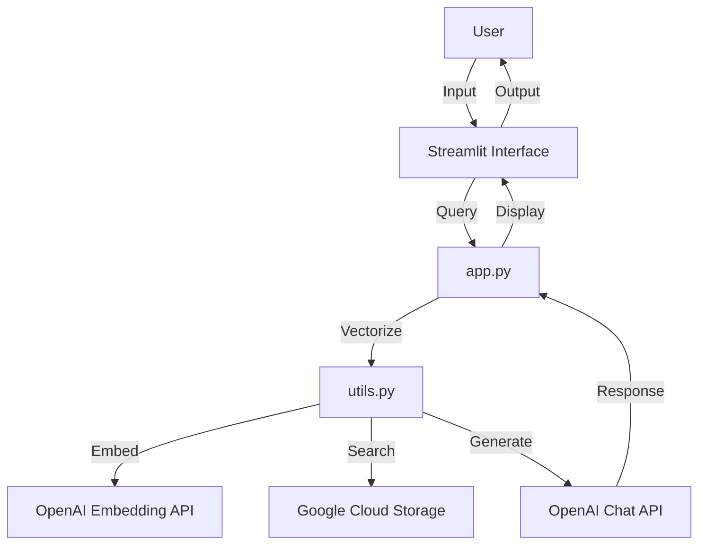

# RAG-Chatbot

[](https://opensource.org/licenses/MIT)
[](https://www.python.org/downloads/)
[](https://streamlit.io)

## 目次

- [プロジェクト概要](#プロジェクト概要)
- [主な機能](#主な機能)
- [技術スタック](#技術スタック)
- [始め方](#始め方)
  - [前提条件](#前提条件)
  - [インストール](#インストール)
  - [設定](#設定)
- [使用方法](#使用方法)
- [アーキテクチャ](#アーキテクチャ)
- [API リファレンス](#api-リファレンス)
- [トラブルシューティング](#トラブルシューティング)

## プロジェクト概要

Chatbot Interfaceは、高度な自然言語処理技術を活用した対話型AIアシスタントです。このプロジェクトは、Streamlitを使用してユーザーフレンドリーなウェブインターフェースを提供し、OpenAIのGPTモデルとGoogle Cloud Storageを組み合わせて、ユーザーの質問に対して知的で関連性の高い回答を生成します。

このチャットボットは、教育、カスタマーサポート、情報検索など、幅広い用途に適用できるよう設計されています。

## 主な機能

- **インテリジェントな質問応答**: gpt-4o-miniを使用して、複雑な質問にも正確に回答
- **コンテキスト認識**: 過去の会話履歴を考慮した応答生成
- **ドキュメント検索**: 質問に関連する文書を効率的に検索し、回答の精度を向上
- **リアルタイムインタラクション**: Streamlitによる滑らかなユーザーエクスペリエンス
- **カスタマイズ可能**: 簡単に設定を変更可能な柔軟なアーキテクチャ
- **スケーラブル**: Google Cloud Storageを利用した大規模データ処理に対応

## 技術スタック

- **フロントエンド**: Streamlit
- **バックエンド**: Python 3.7+
- **AI/ML**: OpenAI gpt-4o-mini, Embeddings API
- **クラウドストレージ**: Google Cloud Storage
- **その他のライブラリ**: 
  - dotenv: 環境変数管理
  - PyYAML: 設定ファイル解析
  - scikit-learn: ベクトル類似度計算

## 始め方

### 前提条件

- Python 3.7以上
- pip (Pythonパッケージマネージャー)
- Google Cloud Platformアカウント
- OpenAI APIアカウント

### インストール

1. リポジトリをクローンします：

   ```bash
   git clone https://github.com/yourusername/chatbot-interface.git
   cd chatbot-interface
   ```

2. 仮想環境を作成し、アクティベートします：

   ```bash
   python -m venv venv
   source venv/bin/activate
   ```

3. 必要なパッケージをインストールします：

   ```bash
   pip install -r requirements.txt
   ```

### 設定

1. `.env.example`ファイルを`.env`にコピーし、必要な環境変数を設定します：

   ```bash
   cp .env.example .env
   ```

   `.env`ファイルを編集し、以下の変数を設定します：

   ```
   GOOGLE_APPLICATION_CREDENTIALS=path/to/your/credentials.json
   OPENAI_API_KEY=your_openai_api_key
   ```

2. `config.yml`ファイルを確認し、必要に応じて設定を調整します：

   ```yaml
   gcs:
     bucket_name: 'your-bucket-name'
     document_vectors_file: 'document_vectors.json'

   openai:
     embedding_model: 'text-embedding-3-small'
     chat_model: 'gpt-4o-mini'

   streamlit:
     title: 'AI Chatbot'
     input_placeholder: 'メッセージを入力してください'

   system_prompt: '以下の情報のみを使用して回答してください。'
   ```

## 使用方法

1. Streamlitアプリを起動します：

   ```bash
   streamlit run app.py
   ```

2. ブラウザで表示されるURL（通常は `http://localhost:8501`）にアクセスします。

3. チャットインターフェースで質問を入力し、AIアシスタントからの回答を受け取ります。

4. 会話履歴は自動的に保存され、コンテキストとして使用されます。

## アーキテクチャ



## API リファレンス

主要な関数の簡単な説明：

- `load_vectors_from_gcs()`: Google Cloud Storageからドキュメントベクトルをロード
- `vectorize_text(text)`: 入力テキストをベクトル化
- `find_most_similar(question_vector, vectors)`: 最も類似度の高いドキュメントを検索
- `ask_question(question, context)`: GPTモデルを使用して回答を生成


## トラブルシューティング

よくある問題と解決策：

1. **APIキーエラー**: `.env`ファイルが正しく設定されているか確認してください。
2. **GCS接続エラー**: `GOOGLE_APPLICATION_CREDENTIALS`が正しいパスを指しているか確認してください。
3. **Streamlitの起動失敗**: ポート8501が使用可能か確認してください。
